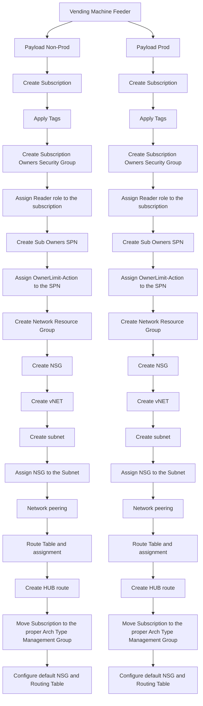

# Hello Docs
---
## HL Azure China Subscription Onboarding process

```kroki-mermaid
sequenceDiagram
autonumber
    actor Requestor
    actor China Regulatory Council
    
    China Regulatory Council->>Vending Machine: Provide Requestor CDSID, AppID, ArchType, vNet size for Corp
    Vending Machine->>China Regulatory Council: Notification: Subscriptions with AppId XXXX was just deployed by CDSID@volvocars.com
    Vending Machine->>Requestor: Notification: Subscriptions with AppId XXXX was just deployed for you
```

# HL Architecture
## Components
- [GH repository](https://github.com/volvo-cars/mb-azure-china_vending_machine/edit/main/README.md)
- [GH SH Runner - pce-gh-runner-vem-001](https://portal.azure.com/#@volvocars.onmicrosoft.com/resource/subscriptions/0c6364d5-fd1c-4270-a5dd-bfe600e46d04/resourceGroups/rg-vending-machine-internal-gh-runner/providers/Microsoft.Compute/virtualMachines/gh-runner-001/overview)
- [GH SH Runner - pce-gh-runner-vem-002](https://portal.azure.com/#@volvocars.onmicrosoft.com/resource/subscriptions/0c6364d5-fd1c-4270-a5dd-bfe600e46d04/resourceGroups/rg-vending-machine-internal-gh-runner/providers/Microsoft.Compute/virtualMachines/gh-runner-001/overview)
- [MSForms](https://forms.office.com/e/gq2B8MmpTR) 
- [LogicApps-VendingMachineFeeder](https://portal.azure.com/#@volvocars.onmicrosoft.com/resource/subscriptions/d563d8cd-37a4-4ef8-a495-cc6347ba8124/resourceGroups/rg-cn-vending_machine/providers/Microsoft.Logic/workflows/VendingMachineFeeder/logicApp)
- [StorageAccount-SubscriptionsInventory](https://portal.azure.com/#@volvocars.onmicrosoft.com/resource/subscriptions/d563d8cd-37a4-4ef8-a495-cc6347ba8124/resourceGroups/rg-cn-vending_machine/providers/Microsoft.Storage/storageAccounts/stcnvendingmachine001/overview)
- [VendingMachineNotifier](https://portal.azure.com/#@volvocars.onmicrosoft.com/resource/subscriptions/d563d8cd-37a4-4ef8-a495-cc6347ba8124/resourceGroups/rg-cn-vending_machine/providers/Microsoft.Logic/workflows/VendingMachineNotifier/logicApp)

# HL Vending Machine flow

```kroki-mermaid
sequenceDiagram

    actor EA Account Owner
    EA Account Owner-->> EA Portal: Create Azure CN subscriptions
    EA Account Owner-->> Subscriptions Inventory: Add created subscriptions to the inventory
    autonumber
    actor Requestor
    box Gray Vending Machine
    participant Requestor
    participant Order Form
    participant Vending Machine Feeder
    participant Vending Machine
    participant MSGraph
    participant MS Teams - PCE
    participant email - Requestor
    end
    Requestor->>Order Form: (AppID, vNET_size, ArchType)
    Order Form->> Vending Machine Feeder: Feeder Payload
    Vending Machine Feeder->>Subscriptions Inventory: Get free subscriptions
    Vending Machine Feeder-->>EA Account Owner: Send notification if there are no free subscriptions
    Vending Machine Feeder->>IPAM: Get free CIDR
    Vending Machine Feeder-->>NetOps: Send notification if there are no free CIDRs
    Vending Machine Feeder->>MSGraph: Get requestor profile
    Vending Machine Feeder->> Vending Machine: Payload
    Vending Machine-->>MS Teams - PCE: Send notification if subscriptions createion failed
    Vending Machine-->>email - Requestor: Send Requestor notification
```

## Vending Machine LL flow

## Vending Machine artifacts naming convention
|Item|Naming convention|Comment|
|--|--|--|
| ${var.app_id}-${var.arch_type}-${lower(var.env_type)}-${var.suffix} | |
| rg-network-${lower(var.env_type)}-001 | |
| AAD Security Group | cld-cn-${var.app_id}-${var.arch_type}-${var.env_type}-${var.suffix}-sg | |
| AAD SPN | spn-cn-${var.app_id}-${var.arch_type}-${var.env_type}-${var.suffix} | |
| Network Security Group | nsg-${var.short_location}-${var.app_id}-${lower(var.env_type)}-001 | |
| Virtual Network | vnet-${var.short_location}-${var.app_id}-${lower(var.env_type)}-001 | |
| Subnet | snet-${var.short_location}-${var.app_id}-${lower(var.env_type)}-001 | |
| vNET Peering | peer-${var.short_location}-${var.app_id}-${lower(var.env_type)}-${var.suffix} | |
| Route Table | rt-${var.short_location}-${var.app_id}-${lower(var.env_type)}-001 | |
| Route | ro-vnet-${var.short_location}-${var.app_id}-${lower(var.env_type)}-${var.suffix} | | 
| Policy Assignment | [VCC]ConfigureDefaultNSGandRTonSub | |

where: \
var.short_location - cn3 \
var.app_id - Application ID \
var.arch_type - Architecture Type (Online|Corp) \
var.env_type - Environment (prod|nonprod) \
var.suffix - Random 3 digit suffix, subscription specific


